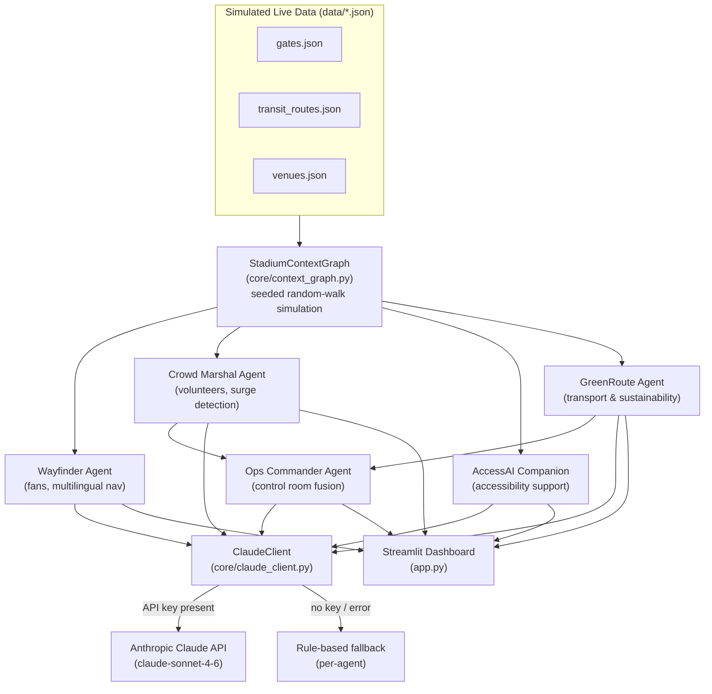

# Architecture — PulseArena AI

## 1. Design Principle

Most GenAI stadium submissions are a single chatbot wrapped around a single prompt.
PulseArena AI is instead a **mesh of specialised agents sharing one live state
object** — the `StadiumContextGraph`. This is the core architectural bet: keeping
every persona's answer consistent with the same underlying reality, and letting
one agent (`Ops Commander`) *compose* the outputs of the others instead of
re-deriving them from scratch.

## 2. Component Diagram

## 3. Why a Shared Context Graph (and not five independent bots)

- **Consistency.** If Crowd Marshal says Gate B is congested, GreenRoute's transit
  recommendation and Ops Commander's situation report reflect the *same* Gate B
  state — nothing contradicts itself, because there's exactly one source of truth.
- **Composability.** Ops Commander doesn't re-analyse raw telemetry; it *fuses*
  the natural-language outputs already produced by Crowd Marshal and GreenRoute.
  This mirrors how a real control room actually works — specialists report up,
  a duty manager synthesises.
- **Extensibility.** Swapping the simulated `context_graph.py` for a real
  telemetry feed (turnstiles, CCTV crowd density, transit APIs) requires no
  changes to any agent — they only depend on the graph's public read methods
  (`busiest_gate()`, `snapshot()`, etc.), not on how that data was produced.

## 4. Reliability: the Offline Fallback Path

Every agent call goes through `ClaudeClient.generate()`, which:

1. Tries the live Anthropic API if `ANTHROPIC_API_KEY` is configured.
2. Falls back to a **per-agent, hand-written, data-grounded template** on any
   failure — missing key, network issue, rate limit, malformed response.

This means the demo is guaranteed to produce a coherent, data-grounded answer
in front of judges even with zero internet access, while still producing
noticeably richer, more natural language the moment a real key is supplied.

## 5. Data Flow for a Single Interaction

1. User asks Wayfinder a question in the Streamlit UI.
2. `WayfinderAgent.answer()` pulls `graph.snapshot()` — the current gate
   queues, amenities, and weather.
3. A system + user prompt is built, grounding the question in that snapshot.
4. `ClaudeClient.generate()` calls the Claude API (or the fallback).
5. The response — plus a `genai_live` flag — is returned to the UI and rendered.

## 6. Simulation Model

`StadiumContextGraph.advance()` performs a bounded random walk on gate queue
lengths and transit load percentages, seeded for reproducibility, and
occasionally emits a mild operational incident from a fixed pool. This gives
judges a live, evolving story to interact with ("advance simulation" button)
without needing real sensor access during the hackathon.
